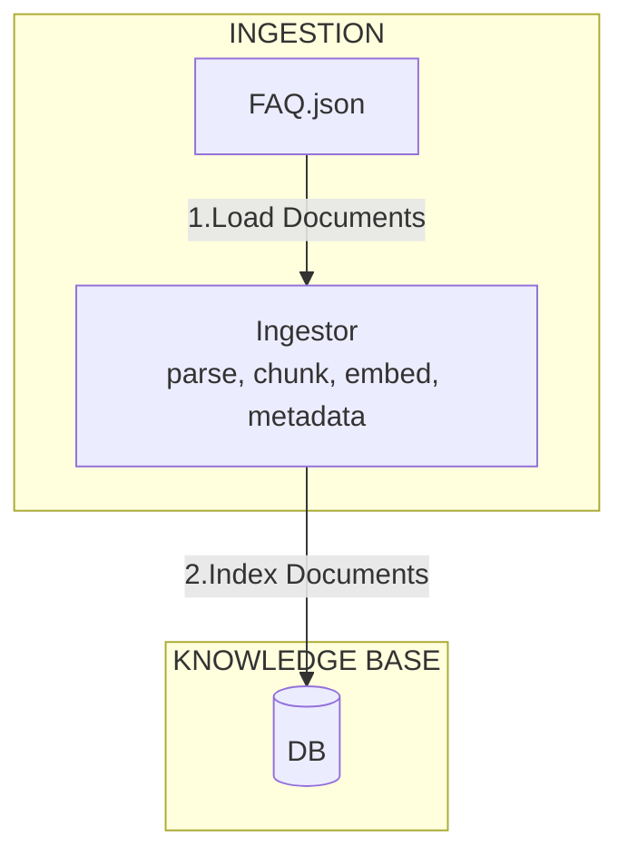
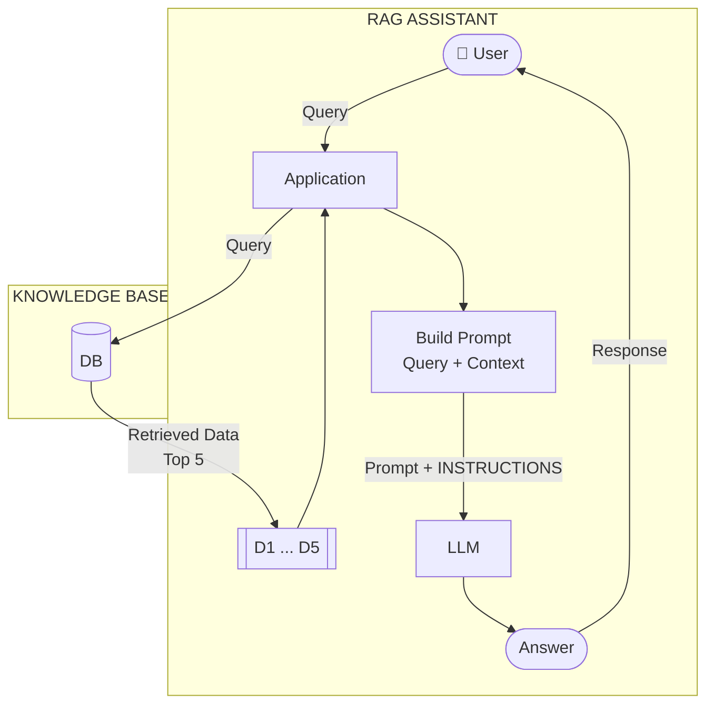

# LLM Zoomcamp - RAG Assistant

This project implements a Retrieval-Augmented Generation (RAG) system designed to answer questions based on course FAQ documents from DataTalks.Club. It leverages Google's Gemini API for language model capabilities and a local SQLite-based search index for efficient document retrieval.

## Project Overview
The goal of this project is to create an intelligent assistant that can provide accurate answers to common questions from course participants. It achieves this by:
1.  **Ingesting** relevant FAQ documents from a web API.
2.  **Indexing** these documents into a local, searchable database.
3.  **Retrieving** the most relevant information based on a user's query.
4.  **Generating** a coherent and contextually accurate answer using a Large Language Model (LLM).

## Architecture diagram

```text
Ingestion (runs once): fetch data -> parse -> write to faq.db
Query (runs every time): open faq.db -> search -> ready
```

### Ingestion Phase: The ingestion process writes documents to the knowledge base Database, faq.db.



### Retrieval Phase - Query - The RAG assistant reads from knowledge base Database, faq.db.



## Details
The system operates in two main phases:

*   **Ingestion Phase (`ingest.py`)**:
    *   Connects to the DataTalks.Club FAQ API to fetch course-related questions and answers.
    *   Processes these documents and stores them in a local SQLite database (`faq.db`) using the `sqlitesearch` library. This database acts as the knowledge base for retrieval.

*   **RAG (Retrieval-Augmented Generation) Phase (`main.py`)**:
    *   Initializes the Gemini API client.
    *   Loads the pre-built search index from `faq.db`.
    *   For a given user query:
        *   Performs a search against the local index to find the most relevant FAQ entries.
        *   Constructs a detailed prompt for the LLM, including the original question and the retrieved context.
        *   Sends this prompt to the Gemini LLM to generate a natural language answer.

## Directory Structure

```
.
├── .vscode/
│   └── launch.json         # VS Code debug configuration
├── ingest.py               # Script for fetching documents and building the search index
├── ingest-sqlite-test.ipynb  # Script to test the SQLite database retreival query
├── main.py                 # Main application for running RAG queries
├── notebook.ipynb          # Jupyter notebook for development and testing
├── .env                    # Environment variables (e.g., GEMINI_API_KEY)
├── faq.db                  # SQLite database for the search index (generated by ingest.py)
├── README.md               # Project documentation
└── uv.lock                 # Dependency lock file for `uv` package manager
```

## Build Instructions

1.  **Clone the repository:**
    ```bash
    git clone https://github.com/your_username/my-llm-zoomcamp-2026.git
    cd my-llm-zoomcamp-2026
    ```

2.  **Create a virtual environment and install dependencies:**
    It's recommended to use `uv` for fast dependency management.
    ```bash
    # If you don't have uv installed: pip install uv
    uv venv
    source .venv/bin/activate  # On Windows: .venv\Scripts\activate
    uv sync
    ```

3.  **Set up environment variables:**
    Create a file named `.env` in the root directory of the project and add your Google Gemini API key:
    ```
    GEMINI_API_KEY="YOUR_GEMINI_API_KEY"
    ```
    Replace `"YOUR_GEMINI_API_KEY"` with your actual API key obtained from Google AI Studio.

## Run Instructions

1.  **Ingest the documents and build the search index:**
    This step fetches the FAQ data from DataTalks.Club and populates the local `faq.db` SQLite database. This only needs to be done once or when the source data changes.
    ```bash
    python ingest.py
    ```
    You should see messages indicating documents being added to the database.

2.  **Run the RAG assistant:**
    Execute the main application to query the RAG system. The `main.py` script currently contains a hardcoded example query.
    ```bash
    python main.py
    ```
    The output will show the user's question and the generated answer from the Gemini LLM, based on the retrieved context.

    To test different questions, you can modify the `query` variable within the `main()` function in `main.py`.

    **Debugging in VS Code:**
    You can use the provided `.vscode/launch.json` configuration to debug `main.py` directly within VS Code. Simply open the project in VS Code, set breakpoints, and start debugging using the "Python: Debug main.py" launch configuration.